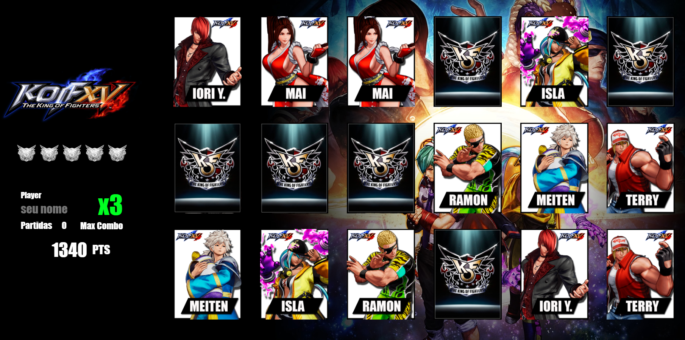
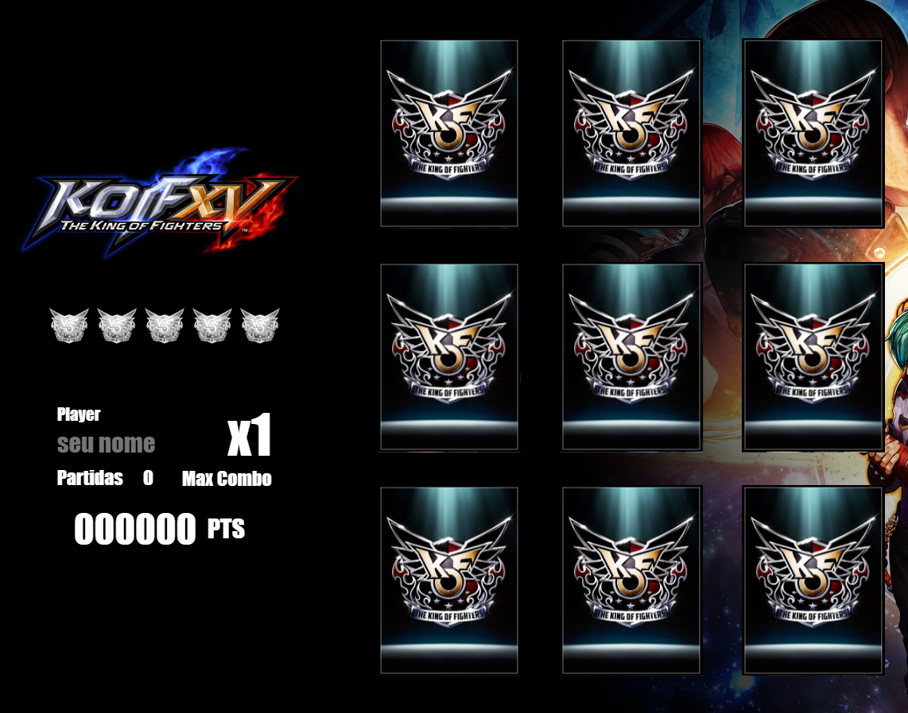

# Modulo 3 concluído - JavaScript :heavy_check_mark:

Finalizado módulo 3 com a conclusão do projeto "Jogo da Memoria", feito a partir das tecnologias HTML/CSS e JS

Agradecimento especial à todos os professores do Módulo de JS e em especial à professora Gabriela pela aula incrível!

Este projeto em específico foi baseado em um tema da famosa série de jogos de luta da SNK, o THE KING OF FIGHTERS.

Segue abaixo algumas imagens do projeto

